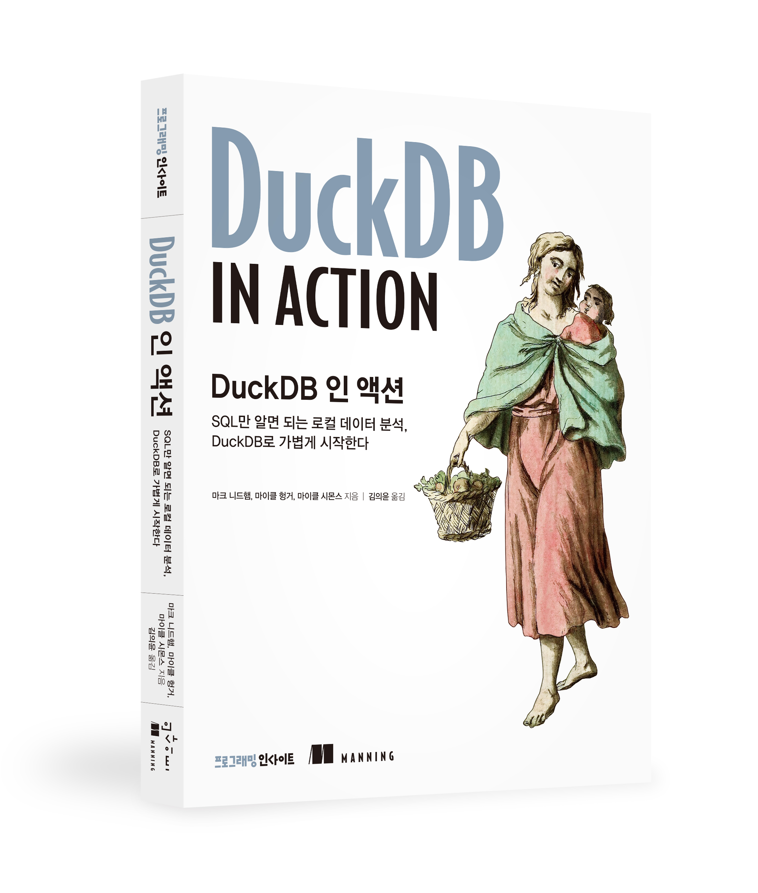

# 《DuckDB 인 액션》

원서 예제 코드에 쓰인 DuckDB 버전: v 0.10  
한국어판 예제 코드에 쓰인 DuckDB 버전: v 1.20.1

최신 버전에서 실행되지 않는 원서의 예제 코드를 최신 버전에 맞춰 수정한 버전입니다. 
번역 과정에서 발견한 코드 오류에 대해서는 원서의 저장소에 요청했으나 아직 반영되지 않았습니다. 이에 대한 안내는 번역서의 본문에도 (옮긴이 주)로 부연했습니다.

[원서의 저장소](https://github.com/duckdb-in-action/examples)  v 0.10 기준(2025.4.23 기준)  
[옮긴이의 저장소](https://github.com/geniuskey/duckdb-in-action-examples) v 1.20.1 기준  

## 도서 소개
[단순함이란 궁극의 정교함이다 – DuckDB, 데이터 분석의 새로운 상식](https://blog.insightbook.co.kr/2025/04/23/%eb%8b%a8%ec%88%9c%ed%95%a8%ec%9d%b4%eb%9e%80-%ea%b6%81%ea%b7%b9%ec%9d%98-%ec%a0%95%ea%b5%90%ed%95%a8%ec%9d%b4%eb%8b%a4-duckdb-%eb%8d%b0%ec%9d%b4%ed%84%b0-%eb%b6%84%ec%84%9d%ec%9d%98-%ec%83%88/)

## 도서 구매
- [교보문고](https://product.kyobobook.co.kr/detail/S000216354896) 
- [YES24](https://www.yes24.com/product/goods/145630370) 
- [알라딘](https://www.aladin.co.kr/shop/wproduct.aspx?ItemId=362832219&start=slayer)